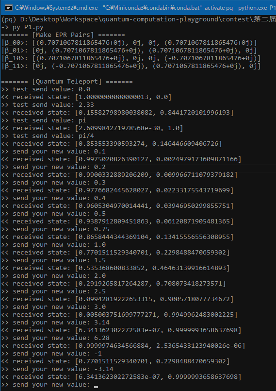

# Problem 1: EPR Pair & Quantum Teleportation

----

### Question, Solution & Analysis

⚪ Making an EPR Pair

**EPR Pair** is the maximum-entangled state of a two-state two-qubits quantum system under computaional basis, which can be prepared by the following circuit:  


(ref: https://en.wikipedia.org/wiki/Bell_state)

Here's the calculation steps in [Tiny-Q](https://github.com/Kahsolt/Tiny-Q) syntax (ignoring globle coeffs):

```
EPR_00 = CNOT * (H @ I) | v00               // phi+
       = CNOT * (v00 + v10)
       = v00 + v11
```

ℹ The maximum entanglement causes infomation of two subsystems to **fully** depend on each other, now note how this is achieved. Firstly, the `H` gate scatters the first zero-state qubit to hadamard basis, turning it to a fair coin. Then `CNOT` flips the second qubit **on condition of** the first one, hence forcing the two qubits' value synchronized. 😀

This state `EPR_00` is also academically denoted as `phi+` state, for other three alternatives starting with `v01`, `v10` and `v11` as initial state, we just need to add some `X` gate, i.e.:

```
EPR_01 = CNOT * (H @ I) * (I @ X) | v00     // psi+
       = CNOT * (H @ I) | v01
       = CNOT * (v01 + v11)
       = v01 + v10

EPR_10 = CNOT * (H @ I) * (X @ I)| v00      // phi-
       = CNOT * (H @ I) | v10
       = CNOT * (v00 - v10)
       = v00 - v11

EPR_11 = CNOT * (H @ I) * (X @ X) | v00     // psi-
       = CNOT * (H @ I) | v11
       = CNOT * (v01 - v11)
       = v01 - v10
```

According to above formula and analysis, here easily comes the `QCircuit` construction by PyQPanda as the solution to sub-problem 1:

```python
# show case s == '11'
#           ┌─┐ ┌─┐
# q_0:  |0>─┤X├ ┤H├ ───■──
#           ├─┤ └─┘ ┌──┴─┐
# q_1:  |0>─┤X├ ─── ┤CNOT├
#           └─┘     └────┘

qc = QCircuit()
for i in range(2):
  if s[i] == '1':
    qc << X(qubits[i])
qc << H(qubits[0]) \
   << CNOT(qubits[0], qubits[1])
```

⚪ Simulating Quantum Teleportation

**Quantum Teleport** is an informational magic, sending **a single quantum state** by alternatively transfering **2-cbits info** INSTEAD OF sending the physical particle itself (that carries the quantum state!!). Or in other words, sending two binary numbers is equivalent to transfering two complex numbers in a probabilistic sense. 😮

Assuming there are three agents:

  - Alice: the message sender
  - Bob: the message receiver
  - Charlie: the trusted third-party

ℹ The story is: Alice wants to send Bob some message in a quantum communication manner, but there's no quantum channel between Alice and Bob, only a classic channel. 
This sounds ridiculous and impossible, but if, Alice and Bob **shares an EPR pair ahead in time**, there's a magic allowing Alice to send some classical information telling 
Bob how to turn the particle state in Bob's hand to be whatever Alice asks it to be.

This quantum teleportation protocol can be discribed as follows:

  - Charlie prepares an ERP-pair `|q1,q0>`, send `|q0>` to Alice and `|q1>` to Bob respectively via quantum channel
  - Alice prepares another qubit `|q2>`, encodes her data on it
  - Alice entangles `|q2>` with `|q0>` using a `CNOT` gate, then performs measurement on `|q2,q0>`, destroying all superpositions
  - Alice reads out 2-bit classic info, sends it to Bob via classic channel
  - Bob do some unitary transform on `|q1>` according to certain rules, this action will finally turn `|q1>` state to `|q2>`, which is in Alice's mind
    - Bob's rule depends on which ERP-pair is exactly used
    - the unitary transform is only concerned with `Z` gate and `X` gate

Also, here's the state evolution in a global view (ingoring global phase):

```
|q2,q1,q0> = |000>                      // mind the endian order :)
  = |0>(|00>+|11>)                      // Charlie makes ERP entanglement on |q1,q0>
  = (a|0>+b|1>)(|00>+|11>)              // Alice encodes her data as a state |phi> on particle |q2>
  = a|000> + a|011> + b|100> + b|111>
  = a|000> + a|011> + b|101> + b|110>   // Alice entangle q2 with q0, aka. CNOT|q2,q0>
  = (a|000> + b|010>) +                 // Alice convert |q2> to hadamard basis, aka. H|q2>
    (a|011> + b|001>) +                 // grouped by |q2,q0> to form 4 branches
    (a|100> - b|110>) +
    (a|111> - b|101>)
|q1> = ?                                // Alice measure q2,q0, deciding which branch it actully falls into
  00 ~> a|0> + b|1>                     // Bob do nothing
  01 ~> a|1> + b|0>                     // Bob apply X
  10 ~> a|0> - b|1>                     // Bob apply Z
  11 ~> a|1> - b|0>                     // Bob apply ZX
=> |q1> = a|0> + b|1>                   // Bob get state |phi>
```

ℹ This magic really reveals some **relativistic** relationship of physical space-time. While we know classical communications all talk about sending messages **through topological/spatial linkage**, quantum teleportation is another way. From Charlie's view, he is the linking point of Alice's and Bob's individual time and space (aka. temporality & locality), as long as the particles hold the informational entanglement, the message can be sent **through historical/temporal linkage** of the two quantum particles (aka. the EPR pair preparation & distribution).

Therefore again the `QCircuit` construction for sub-problem 2 is also easy to show, we use the `EPR_00` as initial state as just analyzed above:

```python
# QProg with uncertain QIfProg is unprintable, here shows things before QIfProg:
#           ┌─┐                ┌────┐ ┌─┐
# q_0:  |0>─┤H├──────── ───■── ┤CNOT├ ┤M├── ───
#           └─┘         ┌──┴─┐ └──┬─┘ └╥┘
# q_1:  |0>──────────── ┤CNOT├ ───┼── ─╫─── ───
#           ┌─────────┐ └────┘    │    ║┌─┐ ┌─┐
# q_2:  |0>─┤RY(value)├ ────── ───■── ─╫┤H├ ┤M├
#           └─────────┘                ║└─┘ └╥┘
# c_0:   0 ════════════════════════════╩═════╬
#                                            ║
# c_2:   0 ══════════════════════════════════╩═
#

prog = QProg() \
     # Charlie's turn
     << H(qubits[0]) \
     << CNOT(qubits[0], qubits[1]) \
     # Alice's turn
     << RY(q2, value) \
     << CNOT(q2, q0) \
     << H(q2) \
     << measure_all([q0, q2], [c0, c2])
     # Bob's turn
     << QIfProg(c2 == 0 and c0 == 1, QProg() << X(q1),
        QIfProg(c2 == 1 and c0 == 0, QProg() << Z(q1),
        QIfProg(c2 == 1 and c0 == 1, QProg() << Z(q1) << X(q1))))
```


### Source Code

Tested under `pyqpanda 3.7.12` + `Python 3.8.15`

```python
#!/usr/bin/env python3
# Create Time: 2023/04/01 

from traceback import print_exc
from typing import List, Tuple, Optional

from pyqpanda import *

qvm = CPUQVM()
qvm.init_qvm()

VALID_INPUTS = ['00', '01', '10', '11']


def make_EPR_pair(s:str, qubits:List[Qubit]) -> QCircuit:
  assert s in VALID_INPUTS

  qc = QCircuit()
  for i in range(2):
    if s[i] == '1':
      qc << X(qubits[i])
  qc << H(qubits[0]) \
     << CNOT(qubits[0], qubits[1])
  
  return qc


def quantum_teleport(value: float) -> List[float]:
  '''
    Simluates the quantum teleportation:
      - https://en.wikipedia.org/wiki/Quantum_teleportation
      - https://projectq.readthedocs.io/en/latest/examples.html#quantum-teleportation
      - https://projectq.readthedocs.io/en/latest/_images/teleport_circuit.png
    Sends **a single quantum state** by alternatively transfering **2-cbits info** 
    INSTEAD OF the physical particle itself (that carries the quantum state!!)
      - It's all about magic theory of the universal shadow! :O

    The state evolution in a global view:
      |q2,q1,q0> = |000>                       // mind the endian order :)
        = |0>(|00>+|11>)                       // Charlie makes ERP entanglement on |q1,q0>
        = (a|0>+b|1>)(|00>+|11>)               // Alice encodes her data as a state |phi> on particle |q2>
        = a|000> + a|011> + b|100> + b|111>
        = a|000> + a|011> + b|101> + b|110>    // Alice entangle q2 with q0, aka. CNOT|q2,q0>
        = (a|000> + b|010>) +                  // Alice convert |q2> to hadamard basis, aka. H|q2>
          (a|011> + b|001>) +
          (a|100> - b|110>) +                    
          (a|111> - b|101>)
      |q1> = ?                    // Alice measure q2,q0, deciding which branch it actully falls into
        00 ~> a|0> + b|1>         // Bob do nothing
        01 ~> a|1> + b|0>         // Bob apply X
        10 ~> a|0> - b|1>         // Bob apply Z
        11 ~> a|1> - b|0>         // Bob apply ZX
      => |q1> = a|0> + b|1>       // Bob get state |phi>
  '''

  def alice(q0: Qubit, value: float) -> Optional[str]:
    '''
      Alice the data sender, she performs:
        - recieves |q0> from Charlie
        - prepares |q2> with data encoded on
        - entangles |q2> with |q0>
        - performs measure on |q2,q0>
        - sends 2-cbit info to Bob
    '''
    nonlocal prog, q2, c2, c0

    prog << RY(q2, value) \
       << CNOT(q2, q0) \
       << H(q2) \
       << measure_all([q0, q2], [c0, c2])

    if not 'due to limitaion of PyQPanda, we have to delay the measure :(':
      qvm.directly_run(QProg() << prog)
      return f'{c2.get_val()}{c0.get_val()}'

  def bob(q1: Qubit, s: Optional[str]) -> List[float]:
    '''
      Bob the data receiver, he performs:
        - recieves |q1> from Charlie
        - recieves 2-cbit info from Alice
        - do some unitary transform on |q1>, turning |q1>'s state to |q0>
    '''
    nonlocal prog, c1, c0, c2

    if isinstance(s, str):
      # this does not work in PyQPanda :(
      assert s in VALID_INPUTS
      if   s == '00': pass
      elif s == '01': prog << X(q1)
      elif s == '10': prog << Z(q1)
      elif s == '11': prog << Z(q1) << X(q1)
    else:
      # when theres an uncertain QIfProg added in, circuit can no more be printed :( 
      prog << QIfProg(c2 == 0 and c0 == 1, QProg() << X(q1),
              QIfProg(c2 == 1 and c0 == 0, QProg() << Z(q1),
              QIfProg(c2 == 1 and c0 == 1, QProg() << Z(q1) << X(q1))))

    return qvm.prob_run_list(prog, [q1])

  def charlie() -> Tuple[Qubit, Qubit]:
    '''
      Charlie the trusted third-party that distributes the ERP-pairs, he performs:
        - prepares an ERP-pair |q1,q0>
        - send |q0> to Alice, |q1> to Bob
    '''
    nonlocal prog, q0, q1

    r = '00'    # we use 'β_00' pair as documented above, use other pairs requires modifying Bob's rules
    prog = QProg() << make_EPR_pair(r, [q0, q1])     # i.e. question1('00')
    return q0, q1

  if 'alloc env':
    qv = qvm.qAlloc_many(3)             # BUG: error unpacking tuple, take a workaround
    q0, q1, q2 = qv[0], qv[1], qv[2]
    cv = qvm.cAlloc_many(3)             # BUG: error unpacking tuple, take a workaround
    c0, c1, c2 = cv[0], cv[1], cv[2]
    prog: QProg = None

  # Step 1: Charlie distributes through q-channel
  q0, q1 = charlie()
  # Step 2: Alice sends through c-channel
  s = alice(q0, value)
  # Step 3: Bob recieves through c-channel
  res = bob(q1, s)

  if 'free env':
    qvm.qFree_all([q0, q1, q2])
    qvm.cFree_all([c0, c1, c2])

  return res


def question1(input: str) -> list:
  q = qvm.qAlloc_many(2)
  prog = QProg() << make_EPR_pair(input, q)
  qvm.directly_run(prog)
  r = qvm.get_qstate()
  qvm.qFree_all(q)
  return r


def question2(theta: float) -> list:
  return quantum_teleport(theta)


if __name__ == '__main__':
  # Q1: make EPR pairs
  print('======= [Make EPR Pairs] =======')
  for s in VALID_INPUTS:
    print(f'|β_{s}>:', question1(s))

    if not 'measure':
      qubits = qvm.qAlloc_many(2)   # |q0,q1>
      cbits  = qvm.cAlloc_many(2)   # c0,c1

      prog = QProg() << make_EPR_pair(s, qubits) << measure_all(qubits, cbits)
      print('measure', qvm.run_with_configuration(prog, cbits, 1000))

      qvm.qFree_all(qubits)
      qvm.cFree_all(cbits)

  print()

  # Q2: quantum teleport
  print('======= [Quantum Teleport] =======')
  print('>> test send value: 0.0')
  print(f'<< received state: {quantum_teleport(0.0)}')
  print('>> test send value: 2.33')
  print(f'<< received state: {quantum_teleport(2.33)}')
  print('>> test send value: pi')
  print(f'<< received state: {quantum_teleport(3.14159265358979)}')
  print('>> test send value: pi/4')
  print(f'<< received state: {quantum_teleport(3.14159265358979 / 4)}')

  try:
    while True:
      v = input('>> send your new value: ')
      try: v = float(v)
      except: v = None

      if v is None: continue
      r = quantum_teleport(v)
      print(f'<< received state: {r}')
  except KeyboardInterrupt:
    print('Exit by Ctrl+C')
  except:
    print_exc()
```

Run demo:



----
2023/04/03
