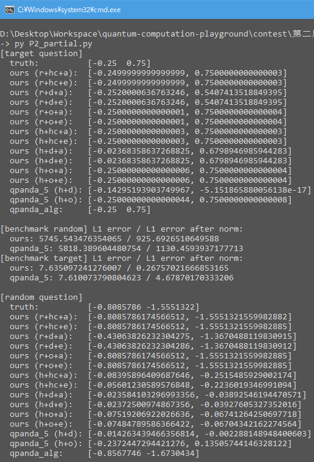

# Problem 2: HHL Algorithm

----

### Problem & Analysis

Solving a linear equation `A * x = b` in a quantum computaional manner, where `A` is an square matrix and `b` is an vector with matching dimension. For a simple example:

```
Solving Ax = b where A is
  [   1,     1]
  [1/√2, -1/√2]
and b is
  [ 1/ 2]
  [-1/√2]

The solution is unique:
  [-1/4]
  [ 3/4]
```

From linear algebra basics, we know that the solution `x` might be one from nothing, unique, or an ensemble, depending on the rank of the expanded matrix `[A|b]`. In **any of these cases** noted, we can apply the [Gaussian Elimination](https://en.wikipedia.org/wiki/Gaussian_elimination) method or [Matrix Inversion](https://en.wikipedia.org/wiki/Invertible_matrix) to get the accurate answer, but naive implementations cost time of `O(n^2)`, while the most optimized classical algorithm reduces it to `O(N*sqrt(k))`, where `k` describes the cost for inversing the matrix. However, in **case of unique solution**, we have another perspective view and thoughts upon form of the linear equation, where is also probably the [HHL Alogrithm](https://arxiv.org/abs/0811.3171) derives. 😀

In quantum computation traditions, `U` denotes a quantum gate and `|phi>` denotes a quantum state, when `U` is applied to `|phi>`, it turns to be a new state, say `U |phi> -> |psi>`. Corresponding to the physical process that, a quantum system **evolves** its state from `|phi>` to `|psi>` under the environment influence `U`. Compared with the linear equation `A * x = b`, it's easy to figure out the logical structure in parallel:

```
quantum evolution:  U |phi> -> |psi>
  linear equation:  A   x   =    b

where U and A are square matrices, others are all vectors in computational representation
```

ℹ From this view, solving a linear equation is like to **finding the initilal state of a quantum evolution process** where the final state is known to be `|psi>` while the evolution operator is `U`. Due to the **reversible computing** nature of quantum computating, this is not a magic in philosophical sense. 😉


### Solution

Now it's clear enough to put an elephant into the refrigerator:

  - Encode classical `A` and `b` to quantum `U` and `|psi>`
    - ⚠ tricky: find ways to satisfy the required `unitary & unit vector` condition for `A` and `b`
  - Find `|phi>` through matrix inversion of `U`, aka. computing the reversed `|phi> = U†|psi>`
    - ⚠ tricky: do not inverse `U` directly, but instead decompose `|psi>` to `U`'s eigen vectors, then simply inverse the eigen values 🥴
  - Decode `|phi>` to get the solution `x` (in a probablistic approximated sense)

Assuming the toy case `dim(A) = rand(A) = 2`, we implement & explain the HHL alogrithm in both mathematic and programmatic view in following sections.

#### HHL in a mathematic view

Firstly, here's the mathematic formula outline sketch:

```
Our goal is to approximate this state |x>:
A|x> = |b>                    // assume A is an invertibe hermitian (no need be unitary), and |b> is a unit vector
 |x> = A^(-1) |b>
     = Σi 1/λi |vi><vi| |b>              // eigen decomposition of A^(-1) where λi and |vi> are the i-th eigen pair of A
     = (Σi 1/λi |vi><vi|) (Σj βj |vj>)   // decompose |b> to A's eigen basis |vi>; i,j ∈ [0, N-1], N = dim(A)
     = ΣiΣj βj/λi |vi><vi|vj>
     = ΣiΣj βj/λi |vi>                   // <vi|vj> == 1 if i==j else 0
     = Σi (Σj βj) 1/λi |vi>              // aggregate inner const coeffs
     = Σi βi/λi |vi>                     // rename, βi only depends on i

Firstly, consider estimating eigvals of A over vector |b>, using two ancilla qubits inited as |00>:
  = QPE_2(A, |00b>)
  = C_02(U^2^1) * C_12(U^2^0) * (H @ H @ I) |00b>     // |q0,q1,q2>, C_ij(U) denotes controlled-unitary U on |qi> over |qj>
  = C_02(U^2) * C_12(U) * |++b>                       // |+> = H|0>, θk for q[k-1]
  = C_02(U^2) * C_12(U) * |+>(|0>+|1>)|b>             // ignore global phase
  = C_02(U^2) * |+>(|0b>+|1>U|b>)
  = C_02(U^2) * (|0>+|1>)(|0b>+|1>U|b>)
  = C_02(U^2) * (|00b> + |01>U|b> + |10b> + |11>U|b>)
  = |00b> + |01>U|b> + |10>U^2|b> + |11>U^3|b>        
  = (Σk |k> U^k) |b>                                  // <= how to choose U, then reduce U^k|b> ??

let U = exp(iAt) = Σj exp(i*λj*t*k) |vj><vj| where t is a tunable parameter (eg. 2*pi), now U is unitary since A is hermitian :)
  = (Σk |k> exp(iAt)^k) |b>
  = (Σk |k> exp(iAtk)) |b>
  = (Σk |k> exp(iAtk) |vj><vj|) |b>                   // again decompse |b>, U has the same eigvecs with A
  = (Σk |k> exp(iAtk) |vj><vj|) (Σi βi |vi>)          // <vi|vj> == 1 if i==j else 0
  = Σk |k> (Σj βj exp(iAtk) |vj>)
  = Σj βj (Σk |k> exp(iAtk)) |vj>                     // law of commutativity 
  = Σj βj (Σk |k> (Σs exp(i*λs*t*k) |vs><vs|)) |vj>
  = Σj βj (Σk |k> exp(i*λj*t*k)) |vj>                 // <vs|vj> == 1 if s==j else 0
  = Σj βj (Σk exp(i*λj*t*k)|k>) |vj>                  // law of commutativity for a scalar
  ≈ Σj βj |λj'> |vj>                                  // FIXME: jump of faith following the standard QPE??
where λj' is the n-qubit binary approximation to 2^n*(λj*t/2*pi), while λj is the real eigvals, i.e.:
  λj' = 2^n * (λj*t) / (2*pi)
see in order to let λj' to approximate the true λj, we will need:
  1 = 2^n * t / (2*pi)
  t = 2*pi / 2^n
when n = 2 in our case, the t (or in hammilton-similation namely t0) should be:
  t = 2*pi / 2^2
    = pi/2

Now, compare what we've got:
  |z> = Σi βi |λi'> |vi>
and what we'd want:
  |x> = Σi βi/λi |vi>
it would be nicely approximated, if we can:
  - move the index value λj' out from the auxiliary register |λj'>
  - turn it to become the proper coefficient 1/λi

```

#### HHL in a programmatic view

And here's the pseudo-code sketch for the procedure framework:

```python
def HHL(A:Matrix, b:Vector) -> Vector:
  # Step 1: classical preprocess
  (Ah, b_n), stats = transform(A, b)    # transform to `Ah * y = b_n`

  # Step 2: quantum computing
  cq = HHL_circuit(Ah, b_n)             # build qcircuit
  qstate = qvm.run(cq)                  # run and get the final state vector
  y = project_q3(qstate)                # only need amplitude of |q3>

  # Step 3: classical postprocess
  x = transform_inv(y, *stats)          # transform back to get `x`

  return x
```

Components are explained in following sections.

⚪ Transform the equation

To make the quantum evolution framework work, it requires `A` to be **hermitian** while `b` to be a **normalized vector**. 
However, `A` and `b` are **arbitarily** given from a linear equation. 
Follow this to transform an arbitary linear equation to suit valid quantum gate and state:

```python
                Ax = b
           (A'A) x = A'*b           # multiply by A' (A.dagger) at both sides, assert A'A is hermitian
(A'A) (x / |A'*b|) = A'*b / |A'*b|  # devide by |A'*b| at both sides, assert right side is unit vector
           A_h * y = b_n            # rename, now this new equation satisfies all needed condition
```

It is easy to inverse the transformation back later, in order to get the final answer:

```python
x / |A'*b| = y
         x = y * |A'*b|             # the final answer
```

Take the concrete question as example:

```
    Ax = b
=>
    [   1,     1]   = [ 1/ 2]
    [1/√2, -1/√2] x = [-1/√2]
=> 
    [1,  1/√2][   1,     1]   = [1,  1/√2][ 1/ 2]
    [1, -1/√2][1/√2, -1/√2] x = [1, -1/√2][-1/√2]
=>
    [3/2, 1/2]   = [0]
    [1/2, 3/2] x = [1]
=>
    A12 x = |1>
```

It turns out to be the equation that many essays have long played with: `A12 x = |1>` where `A12` is a hermitian matrix with eigvals `1` and `2`. 😀

⚪ Encode qunatum data

Find the circuits to encode the classical data to quantum facts `U = exp(iAθ)` and `|b> = b0|0> + b1|1>`:

```python
def encode_A(A:Matrix, θ:float) -> QGate:
  ''' encode a hermitian A to unitary exp(iAθ) '''
  assert is_hermitian(A)
  u = scipy.linalg.expm(1j*A*θ)       # matrix expotional, turing to be a unitry for hermitian
  assert is_unitary(u)
  return QOracle(u)                   # make an Oracle gate, or `matrix_decompose()` to U4 gates

def encode_b(b:Vector) -> QCircuit:
  ''' encode a unit vector b onto amplitude of |b> '''
  assert is_unit(b)
  θ = 2 * np.arccos(b[0])
  cq = QCircuit() << RY(θ)            # rotate with RY gate
  if b[1] < 0: cq << Z()              # fix the sign of |1> part
  return cq
```

ℹ Parameters for these gates are manually calculated out accroding to [matrix form definition](https://en.wikipedia.org/wiki/List_of_quantum_logic_gates), this is unnatural but on its way...

⚪ Main circuit routine

Construct the main circuit routine as HHL reqires: QPE, controlled RY rotation and iQPE.

```python
def HHL_circuit(A:Matrix, b:Vector, t0=2*pi, r=4) -> QCircuit:
  # alloc qubits
  q0, q1, q2, q3 = list(qvm.qAlloc_many(4))

  # Step 1: prepare |b>
  enc_b = encode_b(b, q3)

  # Step 2: apply QPE of A over |b>
  qpe = QCircuit() \
      << H([q1, q2]) \
      << encode_A(A, q3, theta=t0/4).control(q2) \
      << encode_A(A, q3, theta=t0/2).control(q1) \
      << SWAP(q1, q2) \
      << H(q2) \
      << S(q2).dagger().control(q1) \
      << H(q1) \
      << SWAP(q1, q2)

  # Step 3: controlled rotate
  rc = QCircuit() \
     << RY(q0, 2*pi/2**r).control(q1) \
     << RY(q0,   pi/2**r).control(q2)

  return enc_b << qpe << rc << qpe.dagger()
```


### Source Code

Run demo:



⚠ The whole source code is extremely long, as we've did a lot of fruitless experiments and explorations. 😂

Tested under `pyqpanda 3.7.12` + `Python 3.8.15`

```python
```

### references

- https://arxiv.org/abs/0811.3171 **(root thesis)**
- https://arxiv.org/abs/1110.2232
- https://arxiv.org/abs/1302.1210
- https://arxiv.org/abs/1805.10549
- https://arxiv.org/abs/1302.4310
- https://arxiv.org/abs/1302.1946
- https://en.wikipedia.org/wiki/Quantum_algorithm_for_linear_systems_of_equations
- https://qiskit.org/textbook/ch-applications/hhl_tutorial.html **(highly recommended)**
- https://zhuanlan.zhihu.com/p/164375189
- https://zhuanlan.zhihu.com/p/426811646
- https://www.qtumist.com/post/5212
- https://pyqpanda-toturial.readthedocs.io/zh/latest/HHL.html
- https://en.wikipedia.org/wiki/Matrix_exponential
- https://en.wikipedia.org/wiki/Sylvester's_formula#special_case

----
2023/04/03
